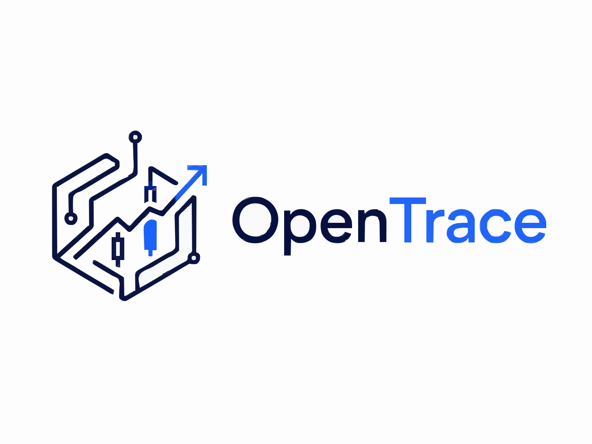
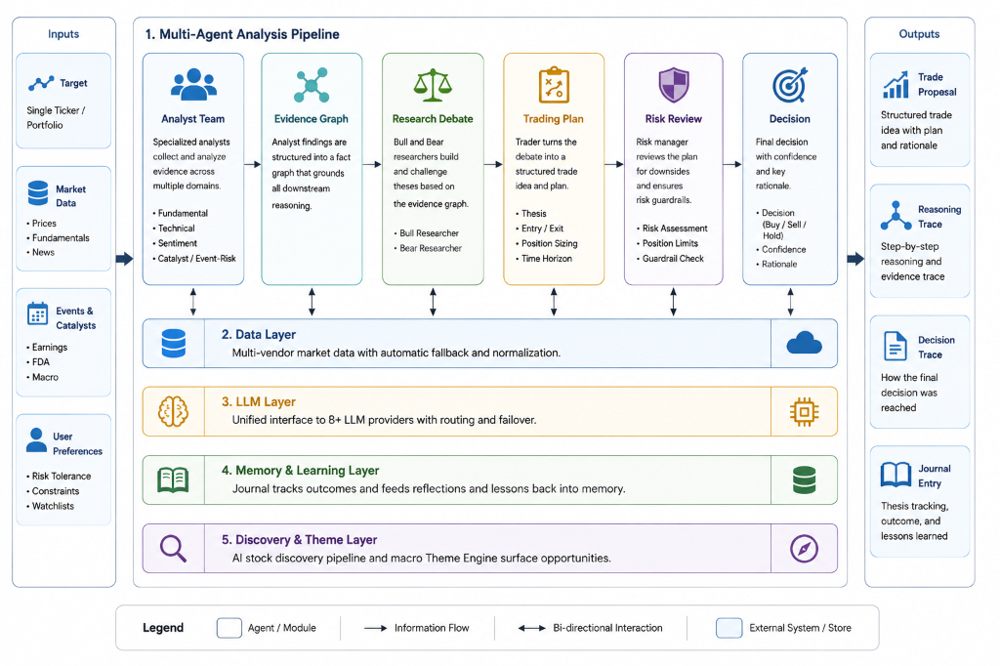

<div align="center">
  

  <p><em>An open-source multi-agent AI trading framework where each agentic analyst follows a structured reasoning graph, with visible reasoning traces and decision traces from evidence to final trade proposal.</em></p>

  <p>
    <a href="LICENSE"></a>
    
    
    
    
  </p>

  
</div>

---

## 🔭 What is OpenTrace?

OpenTrace turns a single ticker (or your whole portfolio) into a **transparent, auditable trade
recommendation** produced by a team of specialised LLM agents. Instead of a black-box "buy/sell"
signal, every conclusion is backed by a **trace** you can read: which evidence each analyst found,
how the bull and bear sides argued, what the risk team flagged, and why the final decision was made.

```text
Analysts  →  Evidence Graph  →  Bull/Bear debate  →  Trader plan  →  Risk review  →  Decision (+ optional trade)
   every arrow above is captured as a readable reasoning & decision trace
```

---

## 🧭 Choose your path

Jump straight to what you came for:

| If you are… | Start here |
|:--|:--|
| ⚡ **Just want to run it** | [Quick Start — Web App](#-quick-start--web-app) → open the browser UI in minutes |
| 💻 **Terminal-first** | [Quick Start — CLI](#-quick-start--cli) → guided, no config files to edit |
| 🐍 **Building on top of it** | [Python API](#-python-api-programmatic) → embed OpenTrace in your own scripts |
| 🔬 **Researching multi-agent LLMs** | [Reasoning & Decision Traces](#-reasoning--decision-traces) · [Architecture](#%EF%B8%8F-architecture) · [Risk awareness](#%EF%B8%8F-crowding--macro-pullback-awareness) |
| 💼 **Trading (paper or live)** | [CLI](#-quick-start--cli) · [Trade execution config](#%EF%B8%8F-configuration) · [Troubleshooting](#-troubleshooting--faq) |
| 🛠️ **Contributing** | [`CONTRIBUTING.md`](CONTRIBUTING.md) |

---

## ✨ What you get

OpenTrace builds on [Tauric Research's TradingAgents](https://github.com/tauricresearch/tradingagents)
(see [Credits](#-credits--acknowledgments)) and extends it into a transparent, risk-aware system.

| Capability | What it gives you |
|:--|:--|
| 🔎 **Visible reasoning & decision traces** | The namesake feature — every step from raw evidence to the final proposal is captured and rendered in the web UI. [Details ↓](#-reasoning--decision-traces) |
| 🔗 **Evidence graph** | Analyst findings are distilled into a structured fact graph that grounds every downstream agent, reducing hand-wavy reasoning. |
| 🧩 **Structured agent pipeline** | Specialised analysts → bull/bear debate → trader plan → risk review → execution, wired as a [LangGraph](https://github.com/langchain-ai/langgraph) workflow. |
| 🗞️ **Catalyst & event-risk awareness** | A dedicated analyst surfaces earnings, FDA, and macro catalysts that move prices. |
| 🛡️ **Crowding & macro-pullback awareness** | **(new)** A regime context bus + per-ticker **Pullback Vulnerability Score** + peer/sector read-through warn when a crowded, extended name is fragile. [Details ↓](#%EF%B8%8F-crowding--macro-pullback-awareness) |
| 🧠 **Closed-loop learning** | A journal subsystem tracks each thesis to its real outcome and feeds the lessons back into agent memory. |
| 🛰️ **AI stock discovery** | A multi-stage screener finds promising tickers, then runs the full pipeline on the best candidates. |
| 🔌 **Bring your own model & data** | 9 LLM providers (incl. local Ollama) and 6+ market-data vendors with automatic fallback. Start free with Yahoo Finance and one LLM key. |
| 💸 **Paper or live execution** | Optional Alpaca integration with position-size and concentration guardrails and 5 order types. |

<details>
<summary><b>📊 Full comparison — what OpenTrace adds over the original TradingAgents</b></summary>

<br>

| Area | Addition in OpenTrace |
|:--|:--|
| **Transparency** | Reasoning & decision **traces** plus a React UI to inspect them ([details](#-reasoning--decision-traces)) |
| **Grounding** | **Evidence Graph** synthesis layer between analysts and researchers |
| **New analyst** | **Catalyst / Event-Risk Analyst** (earnings, FDA, macro catalysts) |
| **Risk awareness** | **Macro-regime context bus**, per-ticker **Pullback Vulnerability Score**, and **peer/sector read-through** with a dedicated risk-judge override ([details](#%EF%B8%8F-crowding--macro-pullback-awareness)) |
| **Learning** | **Journal** subsystem: thesis state machine, outcome monitoring, reflection → lesson memory |
| **Discovery** | Multi-stage **stock-discovery** pipeline + a macro **Theme Engine** |
| **Decision rigor** | Structured **Decision Schema** + pre-execution **Decision Guard** validation |
| **Execution** | Live/paper **Alpaca** execution with concentration & position-size guardrails and 5 order types |
| **Reach** | 9 LLM providers (OpenAI, Azure Foundry, Anthropic, Google, DeepSeek, Qwen, GLM, OpenRouter, Ollama) and a multi-vendor data layer with fallback |
| **Engineering** | A **context-budget** manager for token control, plus full FastAPI + React + Typer/Rich apps |

</details>

---

## 🚀 Quick Start — Web App

The web interface is the easiest way to get started. It launches a **React + Vite** frontend and a **FastAPI** backend.

**Prerequisites**

| Tool | Version | Check |
|:--|:--|:--|
| Python | ≥ 3.10 | `python --version` |
| Node.js | ≥ 18 | `node --version` |
| npm | ≥ 9 | `npm --version` |

**1 — Clone & install**

```bash
git clone https://github.com/muye1202/OpenTrace.git
cd OpenTrace

pip install -e .       # or, if you have uv:  uv sync
```

**2 — Configure API keys**

```bash
cp .env.example .env         # Linux / macOS
copy .env.example .env       # Windows
```

Open `.env` and paste in at least one LLM provider key (OpenAI, Azure Foundry, Anthropic, Google,
DeepSeek, …). That's all you need — market data from Yahoo Finance works with no key at all.

> [!TIP]
> See [`.env.example`](.env.example) for every supported key and what it does.

**3 — Install frontend dependencies**

```bash
cd frontend && npm install && cd ..
```

**4 — Launch** — open **two terminals** from the project root:

```bash
# Terminal 1 — Backend (FastAPI)
uvicorn api.main:app --reload

# Terminal 2 — Frontend (Vite)
cd frontend && npm run dev
```

Open [http://localhost:5173](http://localhost:5173). The frontend talks to the backend on
`http://localhost:8000`, and completed analyses are persisted so you can revisit them from the
**History** view.

> [!NOTE]
> `python run.py` starts both the backend and frontend in a single terminal. Separate terminals
> just give you better visibility into logs.

<details>
<summary><b>💡 What to expect — cost & time</b></summary>

<br>

OpenTrace runs many LLM calls per analysis, so each run takes time and incurs API cost:

| Setting | Rough time | Rough LLM cost* |
|:--|:--|:--|
| **Shallow** depth, small models (e.g. `gpt-4o-mini`, `gemini-2.0-flash`) | ~1–3 min | a few cents |
| **Deep** depth, larger reasoning models | several minutes | ~$0.50–$2+ |
| **Local** models via Ollama | depends on hardware | free (your compute) |

<sub>* Approximate, provider-dependent — not a quote. Watch your provider dashboard for actual usage.</sub>

**First run?** Start with **Shallow** depth and small quick/deep models to confirm everything works
before spending on deeper analyses.

</details>

---

## 💻 Quick Start — CLI

The interactive CLI walks you through every setting step by step — no config files to edit. It needs
the same prerequisites as above plus the editable install (`pip install -e .`).

```bash
python -m cli.main analyze       # or, after editable install:  opentrace analyze
```

`analyze` first asks whether you want **single-ticker analysis**, **portfolio analysis**, or
**AI stock discovery**, then walks you through:

| Prompt | What it does |
|:--|:--|
| **Ticker** | Stock symbol(s) to analyse (e.g. `NVDA`, `AAPL`) |
| **Date** | Analysis date in `YYYY-MM-DD` format |
| **Analysts** | Which specialists to include — Catalyst/Event-Risk, Market, Social, News, Fundamentals |
| **Research depth** | How many debate rounds: **Shallow** (fast) · **Medium** · **Deep** (thorough) |
| **Time horizon** | Target holding period (1–2 weeks up to 2–3 months) |
| **LLM Provider** | OpenAI, Azure Foundry, Google, Anthropic, DeepSeek, Qwen, GLM, OpenRouter, or Ollama |
| **Models** | Quick-thinking model (analysts) and deep-thinking model (judges) |
| **Execution** | Analysis only, or also place a paper trade via Alpaca |

A live terminal dashboard streams agent progress, tool calls, and the growing report in real time.
Results are saved to `results/stocks/{date}/{ticker}/`.

<details>
<summary><b>Portfolio analysis, Stock discovery & Journal commands</b></summary>

<br>

**Portfolio analysis** — `opentrace analyze-portfolio`
Pulls your Alpaca positions, runs a **triage step** to identify which stocks most need attention,
then performs full multi-agent analysis on those. Remaining stocks get a lightweight "HOLD" entry.

**Stock discovery** — runs from the main `analyze` command; choose **"Stock Discovery (AI finds
promising stocks)"** at the first prompt. The system screens for promising tickers using multi-factor
scoring, then runs deep multi-agent analysis on the top candidates. You can launch a fresh discovery
run or resume from a previously saved candidate list. See
[Stock Discovery mode](#%EF%B8%8F-architecture) under Architecture.

**Journal** — `opentrace journal`
Track trade outcomes and build agent memory. See [`journal_cli/README.md`](journal_cli/README.md).

</details>

> [!TIP]
> Run `opentrace --help` (or `python -m cli.main --help`) to see every command and option.

---

## 🐍 Python API (programmatic)

For scripting or integration, skip the UI entirely:

```python
from opentrace.graph.opentrace_graph import OpenTraceGraph
from opentrace.default_config import DEFAULT_CONFIG
from dotenv import load_dotenv

load_dotenv()

config = DEFAULT_CONFIG.copy()
config["llm_provider"]      = "google"          # or "openai", "azure-foundry", "anthropic", "deepseek", etc.
config["deep_think_llm"]    = "gemini-2.5-flash"
config["quick_think_llm"]   = "gemini-2.0-flash"

ta = OpenTraceGraph(config=config)

# Returns the full state and a structured trade decision
state, decision = ta.propagate("NVDA", "2024-05-10")
print(decision)
```

---

## 🔬 Reasoning & Decision Traces

Transparency is OpenTrace's reason for existing. Every analysis emits two kinds of trace, both
viewable in the web UI:

- **Reasoning trace** — for each agent, *what it looked at and how it concluded*. Built by
  [`graph/reasoning_trace.py`](opentrace/graph/reasoning_trace.py) and surfaced in the
  **Trader Reasoning** and **Evidence Graph** panels.
- **Decision trace** — the chain from evidence → research debate → trader plan → risk review →
  final structured decision, rendered in the **Decision Trace** panel. The final decision itself is
  a structured object validated against [`graph/decision_schema.py`](opentrace/graph/decision_schema.py)
  and extracted by [`graph/signal_processing.py`](opentrace/graph/signal_processing.py).

Conceptually, a trace lets you answer "*why this trade?*" at every level:

```text
Evidence Graph        →  "Q3 revenue +18% YoY; RSI 71 (overbought); insider selling last week"
   ↓
Research debate       →  Bull: durable demand · Bear: valuation stretched → Manager: cautious BUY
   ↓
Trader plan           →  BUY, LIMIT @ $X, size 10% of buying power
   ↓
Risk review           →  Conservative trims size; Risk Judge approves with concentration cap
   ↓
Final decision        →  { action: BUY, order_type: LIMIT, qty: ..., rationale: ... }
```

<sub>Illustrative — the exact fields come from the decision schema and evidence-graph code above.</sub>

The web UI renders these via dedicated React panels (`DecisionTracePanel`, `TraderReasoningPanel`,
`EvidenceGraphPanel` under `frontend/src/`), so you can expand any agent's contribution instead of
trusting a single opaque verdict.

---

## 🏗️ Architecture

OpenTrace is built on **LangGraph** — each agent is a node in a directed workflow graph. Here is the full pipeline:



### 🧠 Two tiers of LLM

Every agent uses one of two model slots — you set both in one place (`deep_think_llm`,
`quick_think_llm`) and the system routes them automatically:

| Tier | Used by | Why |
|:--|:--|:--|
| **Quick-thinking** | Catalyst / Market / Social / News / Fundamentals Analysts, Bull & Bear Researchers, Trader, Risk Debaters | Speed and cost — these agents run many times and don't need heavy reasoning |
| **Deep-thinking** | Research Manager, Risk Judge, Portfolio Triage Agent | The key decision points where accuracy matters most; a stronger model pays off here |

### 🔗 Evidence graph

After the analysts finish, OpenTrace doesn't just concatenate their reports. It distills them into a
**structured evidence graph** ([`agents/utils/agent_runtime/evidence_graph.py`](opentrace/agents/utils/agent_runtime/evidence_graph.py))
— a compact set of typed facts (catalysts, metrics, risks, sentiment) that every downstream agent
references. This keeps the bull/bear debate and the trader anchored to concrete evidence instead of
free-floating prose, and it's what powers the Evidence Graph panel in the UI.

<details>
<summary><b>🗄️ Data layer — routing, fallback & per-analyst tools</b></summary>

<br>

All market-data tool calls go through a single routing layer
([`dataflows/interface.py`](opentrace/dataflows/interface.py)). You pick a preferred vendor per
category in your config; if that vendor is unavailable the system silently tries the next one.

Each analyst has access to a curated set of data tools:

| Analyst | Key tools |
|:--|:--|
| **Catalyst Event** | Catalyst event bundle, company news window, SEC filings, insider transactions, price action |
| **Market** | Stock data, indicators, VWAP, options flow, dark pool volume, short interest |
| **Social** | News, company news window, news sentiment |
| **News** | News, company news window, global news, news sentiment, SEC filings |
| **Fundamentals** | Fundamentals, balance sheet, cash flow, income statement, insider sentiment & transactions |

> [!TIP]
> When `enable_bundle_tools` is on (default), each analyst also gets a one-shot "bundle" tool that
> fetches all key data in a single call, reducing LLM turns and latency.

</details>

<details>
<summary><b>💾 Memory & closed-loop learning (Journal)</b></summary>

<br>

Each agent team has its own **vector-store memory** (backed by ChromaDB). On top of that, the
**Journal** subsystem ([`opentrace/agents/journal/`](opentrace/agents/journal/)) closes the loop
between a decision and its real-world outcome:

- **Thesis extraction & state machine** — each trade's thesis is captured and tracked through its
  lifecycle (open → playing out → invalidated/realized).
- **Condition & outcome monitoring** — a scheduler watches positions, infers triggering events, and
  records what actually happened.
- **Reflection → lesson memory** — `reflect_and_remember()` turns outcomes into lessons that are
  retrieved the next time a similar setup appears, so the system improves with experience.

See [`opentrace/agents/journal/USAGE.md`](opentrace/agents/journal/USAGE.md) and
[`journal_cli/README.md`](journal_cli/README.md).

</details>

<details>
<summary><b>📁 Portfolio mode & 🔎 Stock Discovery mode</b></summary>

<br>

**Portfolio mode** — an additional **Triage Agent** runs first. It scans all your positions and picks
the ones that need the most attention right now — based on breaking news, unusual price moves,
concentration risk, and more. Only those stocks go through the full multi-agent pipeline; everything
else gets a quick "HOLD" recommendation.

**Stock Discovery mode** — the discovery pipeline runs independently of the main analysis graph:

1. **Stage 0 — Catalyst prefilter**: screens for upcoming earnings, FDA events, and macro catalysts
2. **Stage 1 — Multi-factor enrichment**: technical momentum, relative strength, volume analysis across the universe
3. **Stage 2 — Candidate scoring**: composite ranking with configurable relaxation rules
4. **Deep analysis**: top candidates are fed into the full OpenTraceGraph for multi-agent analysis

Supports three tracks: **Enricher** (swing trade), **Anomaly Scan** (intraday/next-day), and
**Dual-Track** (merged). A complementary **Theme Engine**
([`agents/discovery/theme_engine/`](opentrace/agents/discovery/theme_engine/)) scans for active macro
themes and scores how exposed each candidate is to them, so discovery can be steered by what's
actually driving the market.

</details>

---

## 🛡️ Crowding & macro-pullback awareness

Single-ticker pipelines tend to be blind to a whole *class* of risk: a **crowded, extended,
sector-correlated** name getting hit by a **soft / second-order catalyst** (a peer's guidance tone, a
policy headline) in a **deteriorating macro tape** (rising rates, spiking oil, risk-off). None of
those triggers is a discrete, dated, company-specific event — exactly the quadrant a news/catalyst
analyst is built to ignore.

OpenTrace now computes that fragility from data it already fetches and feeds it into every decision:

| Layer | What it does | Default | Config flag |
|:--|:--|:--|:--|
| **Macro / regime context bus** (`macro_regime`) | A once-per-run cross-asset & positioning snapshot — risk-off flag, rate impulse, oil/VIX, sector heatmap, momentum-vs-SPY — injected into the news, catalyst, and risk nodes. | on | `enable_macro_regime_context` |
| **Pullback Vulnerability Score** | A per-ticker, explainable **0–100** rating (LOW / MEDIUM / HIGH / CRITICAL) fusing price **extension** (distance above 50/200-DMA, YTD run), **crowding**, **tape fragility**, and **valuation richness**. | on | `enable_pullback_vulnerability` |
| **Peer & sector read-through** | Pulls peers' earnings dates into the ticker's calendar as `peer_catalyst` events and checks whether the ticker's sector basket is parabolic (basket beta) — so a sector bellwether reporting *tomorrow* becomes a visible, dated risk. | on (earnings + basket beta); peer-**news** fetch off | `enable_peer_read_through` |
| **Risk-judge override** | On a HIGH/CRITICAL rating the Risk Judge is steered toward reduced size, tighter invalidation, or wait-for-trigger on new exposure — a second override path mirroring the catalyst-risk gate. | on | — |

> [!NOTE]
> This capability is grounded in a post-mortem of two real 2026 sector pullbacks (the May memory-complex
> shock and the June AI-infra unwind). Design notes and backtests:
> [`docs/macro_pullback_capability_upgrade.md`](docs/macro_pullback_capability_upgrade.md).

---

## ⚙️ Configuration

All defaults live in [`opentrace/default_config.py`](opentrace/default_config.py). The knobs you'll
reach for most:

| Key | What it controls | Example / default |
|:--|:--|:--|
| `llm_provider` | Which LLM backend to use | `openai` · `azure-foundry` · `anthropic` · `google` · `deepseek` · `openrouter` · `qwen3-cn` · `glm` · `ollama` |
| `deep_think_llm` | Model for judges & managers | `"o4-mini"` · `"gemini-2.5-flash"` · `"claude-sonnet-4-20250514"` |
| `quick_think_llm` | Model for analysts & researchers | `"gpt-4o-mini"` · `"gemini-2.0-flash"` |
| `max_debate_rounds` | Bull ↔ Bear debate rounds | `1` (default), capped at `3` |

<details>
<summary><b>Data vendors & automatic fallback</b></summary>

<br>

Configured per category in the `data_vendors` dict:

| Category | Available sources | Default |
|:--|:--|:--|
| `core_stock_apis` | `alpaca` · `yfinance` · `alpha_vantage` · `twelve_data` · `local` | `alpaca` |
| `technical_indicators` | `alpaca` · `yfinance` · `alpha_vantage` · `twelve_data` · `local` | `alpaca` |
| `fundamental_data` | `alpha_vantage` · `openai` · `local` | `alpha_vantage` |
| `news_data` | `alpha_vantage` · `openai` · `google` · `local` | `alpha_vantage` |

> [!TIP]
> If a vendor is unavailable at runtime the system automatically falls back to the next option —
> nothing crashes. (Finnhub and SEC EDGAR back specific tools such as insider/filing data rather than
> the four switchable categories above.)

</details>

<details>
<summary><b>Trade execution & order types (Alpaca)</b></summary>

<br>

| Key | What it controls | Default |
|:--|:--|:--|
| `alpaca_execution.enabled` | Turn trading on / off | `false` |
| `alpaca_execution.paper_trading` | Paper vs. live | `true` |
| `alpaca_execution.position_size_pct` | Default position size | `0.10` (10%) |
| `alpaca_execution.max_concentration_pct` | Max single-stock concentration | `0.20` (20%) |

| Order type | Description |
|:--|:--|
| `MARKET` | Execute immediately at the current market price |
| `LIMIT` | Execute only at a specified price or better |
| `STOP` | Triggers a market order once the stock hits a stop price |
| `STOP_LIMIT` | Triggers a limit order once the stock hits a stop price |
| `TRAILING_STOP` | Stop that moves with the stock price, locking in gains |

</details>

<details>
<summary><b>Risk-awareness toggles (macro-pullback capability)</b></summary>

<br>

All on by default; set the env var to `false` to disable. See
[Crowding & macro-pullback awareness](#%EF%B8%8F-crowding--macro-pullback-awareness).

| Env var | What it controls |
|:--|:--|
| `OPENTRACE_ENABLE_MACRO_REGIME_CONTEXT` | Build & inject the cross-asset/regime `macro_regime` context bus |
| `OPENTRACE_ENABLE_PULLBACK_VULNERABILITY` | Compute the per-ticker Pullback Vulnerability Score + risk-judge override |
| `enable_peer_read_through` / `enable_sector_parabola` | Peer earnings → `peer_catalyst` events + sector-parabola / basket-beta crowding signal |
| `peer_read_through.fetch_peer_news` | Opt-in bounded peer-news fetch (off by default — costs extra vendor calls) |

</details>

<details>
<summary><b>Context budget mode (avoiding HTTP 400s on small context windows)</b></summary>

<br>

Controls how prompts are compressed to fit within model context windows:

| Mode | Behaviour |
|:--|:--|
| `adaptive` (default) | Cap prompt sections and apply a soft token budget |
| `compact` | Stronger compression for tighter context windows |
| `off` | No limiting — ⚠️ may cause 400 errors on models with strict limits |

Set via `.env`:
```env
OPENTRACE_CONTEXT_BUDGET_MODE=adaptive
```

</details>

---

## 🧰 Troubleshooting & FAQ

| Symptom | Likely cause & fix |
|:--|:--|
| `No API key` / auth errors | A provider key is missing or wrong in `.env`. You need **one** LLM key; market data works with no key via Yahoo Finance. |
| **HTTP 400 — context length exceeded** | The model's context window is too small for the prompt. Keep `OPENTRACE_CONTEXT_BUDGET_MODE=adaptive` (default) or set it to `compact`; avoid `off` on strict models. |
| **HTTP 429 — rate limited** | Your provider is throttling. Use a smaller/faster model, lower research depth, or raise the manager delay knobs (`OPENTRACE_RESEARCH_MANAGER_MIN_DELAY_S`, `OPENTRACE_RISK_MANAGER_MIN_DELAY_S`). |
| Frontend loads but calls fail | The backend isn't running or is on a different port. Start `uvicorn api.main:app --reload` (default `http://localhost:8000`). |
| `npm run dev` fails | Check Node ≥ 18 and run `npm install` inside `frontend/`. |
| ChromaDB / native build errors on install | Ensure you're on Python ≥ 3.10 in a clean virtualenv; upgrade `pip` before `pip install -e .`. |
| Analysis is slow / expensive | Use **Shallow** depth and small quick/deep models (see [cost & time](#-quick-start--web-app)), or run local models with Ollama. |

Run `opentrace --help` to discover every command and flag.

---

## 🤝 Contributing

Contributions — research ideas and engineering fixes alike — are welcome. See
[`CONTRIBUTING.md`](CONTRIBUTING.md) for dev setup, project layout, and the PR process, and
[`CODE_OF_CONDUCT.md`](CODE_OF_CONDUCT.md) for community guidelines.

---

## 📚 Citation

If you use OpenTrace in academic work, please cite this repository (see
[`CITATION.cff`](CITATION.cff)) **and** the upstream TradingAgents framework it builds on:

```bibtex
@software{opentrace,
  title  = {OpenTrace: A multi-agent AI trading framework with visible reasoning and decision traces},
  author = {Jia, Muye},
  year   = {2026},
  url    = {https://github.com/muye1202/OpenTrace}
}

@misc{tradingagents,
  title        = {TradingAgents: Multi-Agents LLM Financial Trading Framework},
  author       = {Tauric Research},
  howpublished = {\url{https://github.com/tauricresearch/tradingagents}}
}
```

---

## 🤝 Credits & Acknowledgments

This project is built upon the open-source [TradingAgents](https://github.com/tauricresearch/tradingagents)
framework developed by Tauric Research. We are grateful to the original authors for their pioneering
work on multi-agent LLM systems for financial analysis and trading.

---

## ⚠️ Disclaimer

OpenTrace is a **research and educational tool**. It is not financial advice. Always paper-trade first
and understand the risks before using real money. The authors are not responsible for any financial
losses incurred through the use of this software.

---

## 📄 License

[Apache License 2.0](LICENSE) — see the [LICENSE](LICENSE) file for details.
