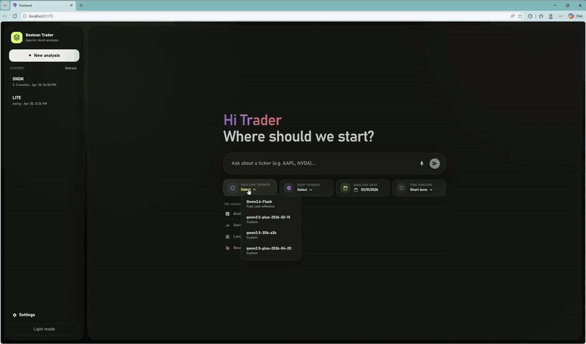

<div align="center">
  

  <p><em>An open-source multi-agent AI trading framework where each agentic analyst follows a structured reasoning graph, with visible reasoning traces and decision traces from evidence to final trade proposal.</em></p>

  <p>
    <a href="LICENSE"></a>
    
    
    
    
  </p>

  
</div>

---

| | |
|:--|:--|
| [🚀 Quick Start — Web App](#-quick-start--web-app) | Launch the browser-based UI in minutes |
| [💻 Quick Start — CLI](#-quick-start--cli) | Run analyses from the terminal |
| [🐍 Python API](#-python-api-programmatic) | Use TradingAgents in your own scripts |
| [⚙️ Configuration](#%EF%B8%8F-configuration) | LLM providers, data vendors, and tuning knobs |
| [🏗️ Architecture](#%EF%B8%8F-architecture) | How the autonomous agent teams collaborate |

---

## 🚀 Quick Start — Web App

The web interface is the easiest way to get started. It launches a **React + Vite** frontend and a **FastAPI** backend.

### Prerequisites

| Tool | Version | Check |
|:--|:--|:--|
| Python | ≥ 3.10 | `python --version` |
| Node.js | ≥ 18 | `node --version` |
| npm | ≥ 9 | `npm --version` |

### Step 1 — Clone & install

```bash
git clone https://github.com/TauricResearch/TradingAgents.git
cd TradingAgents

# Option A — pip (editable install)
pip install -e .

# Option B — uv (faster, if you have uv installed)
uv sync
```

### Step 2 — Configure API keys

```bash
# Copy the template
cp .env.example .env        # Linux / macOS
copy .env.example .env       # Windows
```

Open `.env` and paste in at least one LLM provider key (OpenAI, Anthropic, Google, DeepSeek, etc.). That's all you need — market data from Yahoo Finance works with no key at all.

> [!TIP]
> See [`.env.example`](.env.example) for every supported key and what it does.

### Step 3 — Install frontend dependencies

```bash
cd frontend
npm install
cd ..
```

### Step 4 — Launch

Open **two terminals** from the project root:

**Terminal 1 — Backend (FastAPI)**
```bash
uvicorn api.main:app --reload
```

**Terminal 2 — Frontend (Vite)**
```bash
cd frontend
npm run dev
```

Open [http://localhost:5173](http://localhost:5173) in your browser.

> [!NOTE]
> Alternatively, you can use `python run.py` which starts both the backend and frontend in a single terminal. However, separate terminals give you better visibility into logs.

---

## 💻 Quick Start — CLI

The interactive CLI walks you through every setting step by step — no config files to edit.

### Prerequisites

Same as above ([Python ≥ 3.10](#prerequisites)), plus the editable install:

```bash
pip install -e .
```

### Single-stock analysis

```bash
python -m cli.main analyze
# or, after editable install:
tradingagents analyze
```

You'll be prompted to pick:

| Prompt | What it does |
|:--|:--|
| **Ticker** | Stock symbol(s) to analyse (e.g. `NVDA`, `AAPL`) |
| **Date** | Analysis date in `YYYY-MM-DD` format |
| **Analysts** | Which specialist agents to include — Market, Social, News, Fundamentals |
| **Research depth** | How many debate rounds: **Shallow** (fast) · **Medium** · **Deep** (thorough) |
| **LLM Provider** | Which AI backend: OpenAI, Google, Anthropic, DeepSeek, Qwen, GLM, OpenRouter, Ollama |
| **Models** | Quick-thinking model (analysts) and deep-thinking model (judges) |
| **Execution** | Analysis only, or also place a paper trade via Alpaca |

A live terminal dashboard streams agent progress, tool calls, and the growing report in real time. Results are saved to `results/stocks/{date}/{ticker}/`.

### Portfolio analysis

```bash
python -m cli.main analyze-portfolio
# or
tradingagents analyze-portfolio
```

Pulls your Alpaca positions, runs a **triage step** to identify which stocks most need attention, then performs full multi-agent analysis on those. Remaining stocks get a lightweight "HOLD" entry.

### Stock discovery

The CLI also supports **AI-powered stock discovery** — the system screens for promising stocks using multi-factor scoring, then runs deep analysis on the top candidates.

### Journal

```bash
tradingagents journal
```

Track trade outcomes and build agent memory. See [`journal_cli/README.md`](journal_cli/README.md) for details.

---

## 🐍 Python API (programmatic)

For scripting or integration, skip the UI entirely:

```python
from tradingagents.graph.trading_graph import TradingAgentsGraph
from tradingagents.default_config import DEFAULT_CONFIG
from dotenv import load_dotenv

load_dotenv()

config = DEFAULT_CONFIG.copy()
config["llm_provider"]      = "google"          # or "openai", "anthropic", "deepseek", etc.
config["deep_think_llm"]    = "gemini-2.5-flash"
config["quick_think_llm"]   = "gemini-2.0-flash"

ta = TradingAgentsGraph(config=config)

# Returns the full state and a structured trade decision
state, decision = ta.propagate("NVDA", "2024-05-10")
print(decision)
```

---

## ⚙️ Configuration

All defaults live in [`tradingagents/default_config.py`](tradingagents/default_config.py). Here are the knobs you'll use most:

### LLM settings

| Key | What it controls | Example values |
|:--|:--|:--|
| `llm_provider` | Which LLM backend to use | `openai` · `anthropic` · `google` · `deepseek` · `openrouter` · `qwen3-cn` · `glm` · `ollama` |
| `deep_think_llm` | Model for judges & managers | `"o4-mini"` · `"gemini-2.5-flash"` · `"claude-sonnet-4-20250514"` |
| `quick_think_llm` | Model for analysts & researchers | `"gpt-4o-mini"` · `"gemini-2.0-flash"` |
| `max_debate_rounds` | Bull ↔ Bear debate rounds | `1` (fast) … `5` (thorough) |

### Data vendor options

Configured per category in the `data_vendors` dict:

| Category | Available sources |
|:--|:--|
| `core_stock_apis` | `alpaca` · `yfinance` · `alpha_vantage` · `twelve_data` · `local` |
| `technical_indicators` | `alpaca` · `yfinance` · `alpha_vantage` · `twelve_data` · `local` |
| `fundamental_data` | `alpha_vantage` · `openai` · `local` |
| `news_data` | `alpha_vantage` · `openai` · `google` · `local` |

> [!TIP]
> If a vendor is unavailable at runtime the system automatically falls back to the next option — nothing crashes.

### Trade execution

| Key | What it controls | Default |
|:--|:--|:--|
| `alpaca_execution.enabled` | Turn trading on / off | `false` |
| `alpaca_execution.paper_trading` | Paper vs. live | `true` |
| `alpaca_execution.position_size_pct` | Default position size | `0.10` (10%) |
| `alpaca_execution.max_concentration_pct` | Max single-stock concentration | `0.20` (20%) |

### Supported order types

| Order type | Description |
|:--|:--|
| `MARKET` | Execute immediately at the current market price |
| `LIMIT` | Execute only at a specified price or better |
| `STOP` | Triggers a market order once the stock hits a stop price |
| `STOP_LIMIT` | Triggers a limit order once the stock hits a stop price |
| `TRAILING_STOP` | Stop that moves with the stock price, locking in gains |

### Context budget mode

Controls how prompts are compressed to fit within model context windows:

| Mode | Behaviour |
|:--|:--|
| `adaptive` (default) | Cap prompt sections and apply a soft token budget |
| `compact` | Stronger compression for tighter context windows |
| `off` | No limiting — ⚠️ may cause 400 errors on models with strict limits |

Set via `.env`:
```env
TRADINGAGENTS_CONTEXT_BUDGET_MODE=adaptive
```

---

## 🏗️ Architecture

TradingAgents is built on **LangGraph** — each agent is a node in a directed workflow graph. Here is the full pipeline:

```
┌──────────────────────────────────────────────────────────────────────────┐
│                          📊 Market Data Layer                            │
│  Alpaca · Yahoo Finance · Alpha Vantage · Twelve Data · Finnhub · Local  │
│                   (automatic fallback between sources)                   │
│                                                                          │
│  Tools: stock data · indicators · VWAP · options flow · dark pool ·      │
│         short interest · news · SEC filings · insider transactions        │
└────────────────────────────────┬─────────────────────────────────────────┘
                                 │  price · news · fundamentals · sentiment
                                 ▼
┌──────────────────────────────────────────────────────────────────────────┐
│                       🔍 I. Analyst Team                                 │
│                                                                          │
│  ┌───────────┐  ┌──────────┐  ┌──────────┐  ┌────────┐  ┌────────────┐  │
│  │ Catalyst  │→ │  Market  │→ │  Social  │→ │  News  │→ │Fundamentals│  │
│  │  Event    │  │  Analyst │  │  Analyst │  │ Analyst│  │  Analyst   │  │
│  │  Analyst  │  │          │  │          │  │        │  │            │  │
│  └───────────┘  └──────────┘  └──────────┘  └────────┘  └────────────┘  │
│       Each specialist calls data tools in a loop, then writes            │
│       a focused report. Uses the quick-thinking LLM.                     │
│       (Any combination of analysts can be selected.)                     │
└────────────────────────────────┬─────────────────────────────────────────┘
                                 │  analyst reports
                                 ▼
┌──────────────────────────────────────────────────────────────────────────┐
│                   🔗 Evidence Graph Synthesis                             │
│       Extracts key facts from all analyst reports and builds             │
│       a structured evidence graph for downstream agents.                 │
└────────────────────────────────┬─────────────────────────────────────────┘
                                 │  evidence graph + reports
                                 ▼
┌──────────────────────────────────────────────────────────────────────────┐
│                    💬 II. Research Team Decision                          │
│                                                                          │
│           ┌──────────────┐  ◄──►  ┌──────────────┐                       │
│           │    Bull      │        │    Bear      │                       │
│           │  Researcher  │        │  Researcher  │                       │
│           └──────┬───────┘        └──────┬───────┘                       │
│                  │   (multi-round debate) │                              │
│                  ▼───────────────────────▼                               │
│           ┌────────────────────────────────┐                             │
│           │      Research Manager          │  ← deep-thinking LLM        │
│           │  Judges the debate, writes     │                             │
│           │  the investment decision       │                             │
│           └────────────────┬───────────────┘                             │
└────────────────────────────┼────────────────────────────────────────────┘
                             │  investment decision
                             ▼
┌──────────────────────────────────────────────────────────────────────────┐
│                      📝 III. Trading Team Plan                           │
│                                                                          │
│           ┌────────────────────────────────┐                             │
│           │            Trader              │                             │
│           │  Synthesizes research into a   │                             │
│           │  concrete investment plan with │                             │
│           │  order type & quantity details │                             │
│           └────────────────┬───────────────┘                             │
└────────────────────────────┼────────────────────────────────────────────┘
                             │  proposed plan
                             ▼
┌──────────────────────────────────────────────────────────────────────────┐
│                ⚖️  IV. Risk Management Team Decision                      │
│                                                                          │
│      ┌───────────┐   ┌─────────┐   ┌───────────┐                        │
│      │Aggressive │──►│ Neutral │◄──│Conservative│                       │
│      │  Analyst  │   │ Analyst │   │  Analyst   │                       │
│      └─────┬─────┘   └────┬────┘   └─────┬─────┘                        │
│            └──── (multi-round cycle) ─────┘                              │
│                        │                                                 │
│                        ▼                                                 │
│           ┌────────────────────────────────┐                             │
│           │         Risk Judge             │  ← deep-thinking LLM        │
│           │  Final risk-aware decision     │                             │
│           │  with position-sizing & limits │                             │
│           └────────────────┬───────────────┘                             │
└────────────────────────────┼────────────────────────────────────────────┘
                             │  final structured decision
                             ▼
┌──────────────────────────────────────────────────────────────────────────┐
│                       💰 V. Execution Layer                              │
│                                                                          │
│           ┌────────────────────────────────┐                             │
│           │       Alpaca Executor          │                             │
│           │  Places paper or live orders   │                             │
│           │  Enforces concentration caps   │                             │
│           │  and position-size guardrails  │                             │
│           │  Decision guard validation     │                             │
│           └────────────────────────────────┘                             │
└──────────────────────────────────────────────────────────────────────────┘
```

### 🧠 Two tiers of LLM

Every agent in the system uses one of two model slots:

| Tier | Used by | Why |
|:--|:--|:--|
| **Quick-thinking** | Catalyst / Market / Social / News / Fundamentals Analysts, Bull & Bear Researchers, Trader, Risk Debaters | Speed and cost — these agents run many times and don't need heavy reasoning |
| **Deep-thinking** | Research Manager, Risk Judge, Portfolio Triage Agent | These are the key decision points where accuracy matters most; a stronger model pays off here |

You set both in one place (`deep_think_llm` and `quick_think_llm`) and the system routes them automatically.

### 🗄️ Data layer

All market-data tool calls go through a single routing layer ([`dataflows/interface.py`](tradingagents/dataflows/interface.py)). You pick a preferred vendor per category in your config; if that vendor is unavailable the system silently tries the next one.

Each analyst has access to a curated set of data tools:

| Analyst | Key tools |
|:--|:--|
| **Catalyst Event** | Catalyst event bundle, company news window, SEC filings, insider transactions, price action |
| **Market** | Stock data, indicators, VWAP, options flow, dark pool volume, short interest |
| **Social** | News, company news window, news sentiment |
| **News** | News, company news window, global news, news sentiment, SEC filings |
| **Fundamentals** | Fundamentals, balance sheet, cash flow, income statement, insider sentiment & transactions |

> [!TIP]
> When `enable_bundle_tools` is on (default), each analyst also gets a one-shot "bundle" tool that fetches all key data in a single call, reducing LLM turns and latency.

### 💾 Memory and learning

Each agent team has its own **vector-store memory** (backed by ChromaDB). After a trade plays out, you can call `reflect_and_remember()` to record what happened. The next time a similar situation comes up the agents pull those lessons into their reasoning — so the system genuinely learns from experience over time.

### 📁 Portfolio mode extras

When you run portfolio analysis, an additional **Triage Agent** runs first. It scans all your positions and picks the ones that need the most attention right now — based on breaking news, unusual price moves, concentration risk, and more. Only those stocks go through the full multi-agent pipeline; everything else gets a quick "HOLD" recommendation.

### 🔎 Stock Discovery mode

The discovery pipeline runs independently of the main analysis graph:

1. **Stage 0 — Catalyst prefilter**: Screens for upcoming earnings, FDA events, and macro catalysts
2. **Stage 1 — Multi-factor enrichment**: Technical momentum metrics, relative strength, volume analysis across the screening universe
3. **Stage 2 — Candidate scoring**: Composite ranking with configurable relaxation rules
4. **Deep analysis**: Top candidates are fed into the full TradingAgentsGraph for multi-agent analysis

Supports three tracks: **Enricher** (swing trade), **Anomaly Scan** (intraday/next-day), and **Dual-Track** (merged).

---

## 📁 Project Structure

```
TradingAgents/
├── api/                            # FastAPI backend (REST API)
│   ├── main.py                     # App entry, CORS, DB init
│   ├── routes/                     # /api/analysis, /api/history, /api/discovery
│   ├── schemas.py                  # Request / response Pydantic models
│   └── database.py                 # SQLAlchemy engine + migrations
├── cli/                            # Interactive terminal interface (Typer + Rich)
│   ├── main.py                     # CLI entry point & live dashboard
│   ├── analysis_utils.py           # Single-stock analysis workflow
│   ├── portfolio_analysis_utils.py # Portfolio analysis workflow
│   ├── discovery_utils.py          # Stock discovery workflow
│   └── journal_cli.py             # Trade journal subcommands
├── frontend/                       # React + Vite web interface
│   └── src/
│       ├── App.jsx                 # Main application component
│       ├── index.css               # Styles
│       ├── providerConfig.js       # LLM provider definitions
│       ├── analysisConfig.js       # Analysis config UI
│       └── *Panel.jsx              # Specialized UI panels (evidence graph, etc.)
├── tradingagents/                  # Core framework
│   ├── agents/
│   │   ├── analysts/               # Market, Social, News, Fundamentals, Catalyst Event
│   │   ├── researchers/            # Bull & Bear researchers
│   │   ├── trader/                 # Trader agent + decision brief generator
│   │   ├── risk_mgmt/              # Aggressive, Conservative, Neutral risk debaters
│   │   ├── managers/               # Research Manager & Risk Manager (judges)
│   │   ├── portfolio/              # Triage agent for portfolio mode
│   │   ├── discovery/              # Stock discovery intelligence pipeline
│   │   │   ├── intelligence/       # Prefilters, scoring, anomaly scans, feature matrix
│   │   │   └── theme_engine/       # Macro theme scanner & exposure scoring
│   │   ├── journal/                # Trade journal: ingestion, evaluation, learning
│   │   └── utils/
│   │       ├── agent_runtime/      # States, evidence graph, context budget, tool cache
│   │       ├── market_data/        # VWAP, options flow, dark pool, short interest tools
│   │       ├── memory/             # ChromaDB-backed vector-store memory
│   │       └── llm/                # LLM concurrency control & metrics
│   ├── dataflows/
│   │   ├── interface.py            # Unified data routing (vendor fallback)
│   │   └── vendors/                # Alpaca, Yahoo, Alpha Vantage, Twelve Data, Finnhub, SEC, etc.
│   ├── execution/
│   │   ├── alpaca_executor.py      # Paper & live order execution with guardrails
│   │   ├── decision_guard.py       # Pre-execution validation & market snapshot
│   │   └── portfolio_context.py    # Fetch current positions & account state
│   ├── graph/
│   │   ├── trading_graph.py        # Main LangGraph workflow orchestrator
│   │   ├── setup.py                # Graph node wiring & edge definitions
│   │   ├── stock_discovery.py      # Discovery pipeline graph
│   │   ├── batch_analysis.py       # Multi-ticker batch analysis
│   │   ├── portfolio_analyzer.py   # Portfolio-mode orchestrator
│   │   ├── provider_settings.py    # Per-provider API key & URL resolution
│   │   ├── signal_processing.py    # Decision extraction & structured output
│   │   └── reasoning_trace.py      # Agent reasoning trace builder
│   ├── schemas/                    # Catalyst event models
│   └── default_config.py           # All configuration defaults
├── journal_cli/                    # Journal daemon scripts & import tools
├── data/themes/                    # Theme engine taxonomy & evidence cache
├── .env.example                    # Template for environment variables
├── pyproject.toml                  # Python package metadata & dependencies
├── run.py                          # Launch backend + frontend together
└── README.md
```

---

## 🤝 Credits & Acknowledgments

This project is built upon the open-source [TradingAgents](https://github.com/tauricresearch/tradingagents) framework developed by Tauric Research. We are grateful to the original authors for their pioneering work on multi-agent LLM systems for financial analysis and trading.

---

## ⚠️ Disclaimer

TradingAgents is a **research and educational tool**. It is not financial advice. Always paper-trade first and understand the risks before using real money. The authors are not responsible for any financial losses incurred through the use of this software.

---

## 📄 License

[Apache License 2.0](LICENSE) — see the [LICENSE](LICENSE) file for details.
