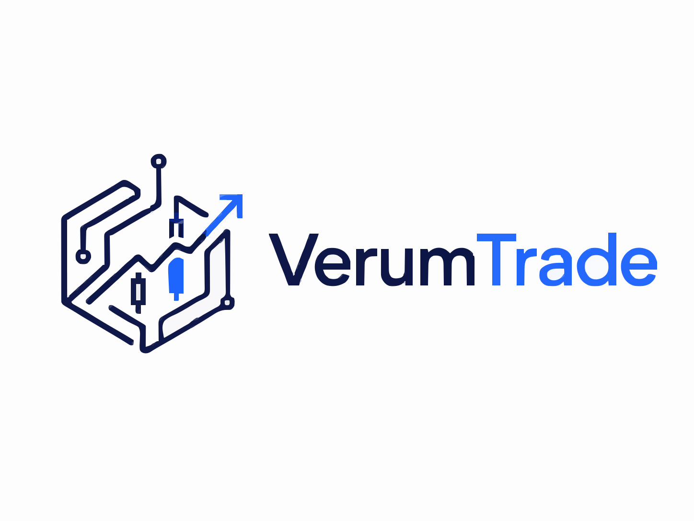

<div align="center">
  

  <p>
    <a href="README.md">English</a>
    ·
    <a href="README.zh-CN.md">简体中文</a>
  </p>

  <p><em>一个开源的多智能体 AI 交易框架。每个智能体分析师都遵循结构化推理图谱，并从证据到最终交易提案保留可见推理轨迹与决策轨迹。</em></p>

  <p>
    <a href="LICENSE"></a>
    
    
    
    
  </p>

  <p>
    <a href="#single-ticker-analysis">观看单股分析流程demo ↓</a>
    ·
    <a href="https://muye1202.github.io/VerumTrade/demos/example-reports/MU-2026-06-23.html">查看美光示例分析 ↗</a>
  </p>
</div>

---

<a id="what-is-verumtrade"></a>

## 🔭 VerumTrade 是什么？

VerumTrade 是一个开源的多智能体交易研究框架，面向两类任务：分析你已经关注的股票，以及发现值得进一步研究的新候选标的。它能够把市场数据、基本面、新闻、情绪、催化因素和风险背景转化为透明的交易论点，而不是黑箱式的“买入/卖出”信号。

名称由拉丁语 *verum*（“真相”）和 *trade* 组成：目标是为每一个决策提供可验证、证据优先的路径。你可以阅读推理过程、检查证据，并审计每条建议是如何形成的，而不必相信一个不透明的评分。

每一次运行都遵循可审计路径：

1. **分析师**收集市场、新闻、社交、基本面和催化证据。
2. **证据图谱**把这些发现提炼为结构化事实。
3. **多空辩论**从正反两面检验交易论点。
4. **交易计划**把辩论结果转化为可执行提案。
5. **风险审查**检查仓位、时机、集中度和下行风险。
6. **决策**记录最终理由、轨迹和可选交易指令。

> [!IMPORTANT]
> VerumTrade 是一个**研究与决策支持流水线**，不是独立投资决策者。请把输出视为结构化的第二意见：检查证据、挑战论点、先做模拟交易，并由你自己决定是否投入真实资金。市场数据可能不完整或延迟，LLM 输出可能出错，交易存在亏损风险。

---

<a id="choose-your-path"></a>

## 🧭 选择你的下一步

直接跳到需要的部分：

| 如果你…… | 从这里开始 |
|:--|:--|
| ⚡ **只想跑起来** | [快速开始 — Web App](#quick-start-web-app) → 几分钟内打开浏览器 UI |
| 💻 **偏好终端** | [快速开始 — CLI](#quick-start-cli) → 交互式引导，无需编辑配置文件 |
| 🎯 **评估单只股票** | [单股票分析](#single-ticker-analysis) → 用完整智能体流水线检查一个标的 |
| 🔎 **寻找候选标的** | [股票发现模式](#stock-discovery-mode) → 筛选市场，再分析最强想法 |
| 🐍 **在其上构建** | [Python API](#python-api-programmatic) → 嵌入到你自己的脚本 |
| 🔬 **研究多智能体 LLM** | [核心工作流](#core-workflows) · [推理与决策轨迹](#reasoning--decision-traces) · [架构](#architecture) |
| 💼 **交易（模拟或实盘）** | [CLI](#quick-start-cli) · [交易执行配置](#configuration) · [故障排查](#troubleshooting--faq) |
| 🛠️ **参与贡献** | [`CONTRIBUTING.md`](CONTRIBUTING.md) |

---

<a id="what-you-get"></a>

## ✨ 你会得到什么

VerumTrade 基于 [Tauric Research 的 TradingAgents](https://github.com/tauricresearch/tradingagents) 构建（见[致谢](#credits--acknowledgments)），并扩展为一个透明、具备风险意识的系统。

| 能力 | 它能带来什么 |
|:--|:--|
| 🔎 **可见推理与决策轨迹** | 项目的核心特性：从原始证据到最终提案的每一步都会被捕获，并渲染到 Web UI 中。[详情 ↓](#reasoning--decision-traces) |
| 🔗 **证据图谱** | 分析师发现会被提炼为结构化事实图谱，用来支撑下游智能体，减少空泛推理。 |
| 🧩 **结构化智能体流水线** | 专业分析师 → 多空辩论 → 交易计划 → 风险审查 → 执行，整体由 [LangGraph](https://github.com/langchain-ai/langgraph) 工作流串联。 |
| 🗞️ **催化与事件风险意识** | 专用分析师会识别财报、FDA 和宏观催化等可能推动价格的事件。 |
| 🛡️ **拥挤度与宏观回撤意识** | **（新增）** 宏观状态上下文总线 + 单股票 **Pullback Vulnerability Score** + 同业/板块传导，在拥挤且涨幅过大的标的变脆弱时发出警示。[详情 ↓](#crowding--macro-pullback-awareness) |
| 🛰️ **AI 股票发现** | 多阶段筛选器会发现有潜力的股票，再对最佳候选运行完整流水线。 |
| 🔌 **自带模型与数据源** | 支持 9 个 LLM 提供商（包括本地 Ollama）和 6+ 市场数据供应商，并带自动 fallback。可从 Yahoo Finance 和一个 LLM key 免费起步。 |
| 💸 **模拟或实盘执行** | 可选 Alpaca 集成，带仓位大小、集中度护栏和 5 种订单类型。 |

<details>
<summary><b>📊 完整对比 — VerumTrade 相比原版 TradingAgents 增加了什么</b></summary>

<br>

| 领域 | VerumTrade 的新增内容 |
|:--|:--|
| **透明度** | 推理与决策**轨迹**，以及用于检查轨迹的 React UI（[详情](#reasoning--decision-traces)） |
| **证据 grounding** | 分析师和研究员之间新增**证据图谱**综合层 |
| **新分析师** | **Catalyst / Event-Risk Analyst**（财报、FDA、宏观催化） |
| **风险意识** | **宏观状态上下文总线**、单股票 **Pullback Vulnerability Score**、**同业/板块传导**，以及专用风险裁判覆盖逻辑（[详情](#crowding--macro-pullback-awareness)） |
| **发现能力** | 多阶段**股票发现**流水线 + 宏观 **Theme Engine** |
| **决策严谨性** | 结构化 **Decision Schema** + 执行前 **Decision Guard** 校验 |
| **执行** | 通过 **Alpaca** 进行实盘/模拟执行，带集中度与仓位护栏和 5 种订单类型 |
| **覆盖范围** | 9 个 LLM 提供商（OpenAI、Azure Foundry、Anthropic、Google、DeepSeek、Qwen、GLM、OpenRouter、Ollama）和带 fallback 的多供应商数据层 |
| **工程能力** | 用于控制 token 的**上下文预算**管理器，以及完整 FastAPI + React + Typer/Rich 应用 |

</details>

---

<a id="core-workflows"></a>

## 🧭 核心工作流

VerumTrade 有两个主要入口：分析你已经关注的股票，或者先发现候选标的，再把最强想法送入同一套多智能体审查流程。

<a id="single-ticker-analysis"></a>

### 单股票分析

当你已经有目标股票，并希望得到可审计的投资或交易论点时，使用这个模式。VerumTrade 会让选定的分析师团队围绕一个 ticker 运行，构建结构化证据图谱，组织多空研究辩论，让交易员提出计划，并把结果交给风险审查，最后产出决策。


> 📹 想看完整质量视频？[下载 MU 单股票演示（MP4）](https://github.com/muye1202/VerumTrade/raw/main/demos/MU_single_ticker_demo_720p_6x.mp4)。

你会得到一份完整报告，包含推理轨迹、决策轨迹、分析师证据、风险备注，以及在启用执行时可选的 Alpaca 模拟/实盘订单。你可以在 Web App 的主分析表单输入 ticker，或者使用 CLI：`python -m cli.main analyze`，并在第一个提示中选择单股票分析。

想先检查输出质量？可以打开交互式 [MU 示例报告](https://muye1202.github.io/VerumTrade/demos/example-reports/MU-2026-06-23.html)。它由一次完成的 VerumTrade 运行生成，并以类似应用的导航、搜索和可折叠报告面板渲染。源文件位于 [`demos/example-reports/MU-2026-06-23.html`](demos/example-reports/MU-2026-06-23.html)。

<a id="stock-discovery-mode"></a>

### 股票发现模式

当你希望 VerumTrade 帮你寻找值得研究的股票，而不是从已知 ticker 开始时，使用这个模式。Discovery 会让市场股票池经过催化、主题、富集、业务拐点、注意力缺口和评分等阶段，再把最有潜力的候选送入更深入的 VerumTrade 分析。

你会得到排序后的候选、证据包、两层发现评分、论点卡，以及所选股票的完整报告。你可以在 Web App 中切换到 Discovery mode，或者使用 CLI：`python -m cli.main analyze`，并在第一个提示中选择 **Stock Discovery (AI finds promising stocks)**。

<!-- TODO: Embed stock discovery mode demo video here. -->

---

<a id="quick-start-web-app"></a>

## 🚀 快速开始 — Web App

Web 界面是最容易上手的方式。它会启动一个 **React + Vite** 前端和一个 **FastAPI** 后端。

**前置条件**

| 工具 | 版本 | 检查方式 |
|:--|:--|:--|
| Python | ≥ 3.10 | `python --version` |
| Node.js | ≥ 18 | `node --version` |
| npm | ≥ 9 | `npm --version` |

**1 — 克隆并安装**

```bash
git clone https://github.com/muye1202/VerumTrade.git
cd VerumTrade

pip install -e .       # 或者，如果你使用 uv：uv sync
```

**2 — 配置 API keys**

```bash
cp .env.example .env         # Linux / macOS
copy .env.example .env       # Windows
```

打开 `.env`，至少填入一个 LLM provider key（OpenAI、Azure Foundry、Anthropic、Google、DeepSeek 等）。这就够了：Yahoo Finance 市场数据不需要 key。

> [!TIP]
> 查看 [`.env.example`](.env.example)，了解所有支持的 key 及其作用。

**支持的数据源**

VerumTrade 默认可以通过无 key 的 Yahoo Finance 路径获取基础股票数据；如果配置了其他 provider key，则会用于更丰富的覆盖、fallback、filings、新闻、基本面和执行数据：

| 数据源 | 设置 | 用途 |
|:--|:--|:--|
| Yahoo Finance / `yfinance` | 无需 key | 股票价格、指标、财务报表和内部人交易的默认 fallback |
| Alpaca | `APCA_API_KEY_ID`, `APCA_API_SECRET_KEY` | 券商市场数据，以及可选模拟/实盘执行 |
| Alpha Vantage | `ALPHA_VANTAGE_API_KEY` | 股价、指标、基本面、财报、内部人数据和新闻 |
| Twelve Data | `TWELVE_DATA_API_KEY` | 技术指标 fallback |
| Finnhub | `FINNHUB_API_KEY` | 公司/全球新闻、新闻情绪、财报日历和内部人数据 |
| SEC EDGAR | 无需 key | 近期公司 filings |
| 本地缓存数据 | 可选 `VERUMTRADE_DATA_DIR` | 离线或缓存 fallback 数据 |
| LLM-backed news | 现有 LLM key | 配置后用于新闻综合 fallback |

运行时可以为每类数据路由到首选供应商，并在供应商不可用时自动 fallback。有关 `data_vendors` 分类，请见[配置](#configuration)。

**3 — 安装前端依赖**

```bash
cd frontend && npm install && cd ..
```

**4 — 启动** — 从项目根目录打开**两个终端**：

```bash
# Terminal 1 — Backend (FastAPI)
uvicorn api.main:app --reload

# Terminal 2 — Frontend (Vite)
cd frontend && npm run dev
```

打开 [http://localhost:5173](http://localhost:5173)。前端会连接 `http://localhost:8000` 后端，已完成的分析会被持久化，你可以从 **History** 视图重新访问。

> [!NOTE]
> `python run.py` 可以在一个终端中同时启动后端和前端。分开终端只是更方便查看日志。

<details>
<summary><b>💡 预期成本与耗时</b></summary>

<br>

VerumTrade 每次分析会运行多次 LLM 调用，因此会消耗时间和 API 成本：

| 设置 | 大致耗时 | 大致 LLM 成本* |
|:--|:--|:--|
| **Shallow** 深度，小模型（如 `gpt-4o-mini`, `gemini-2.0-flash`） | ~1–3 分钟 | 几美分 |
| **Deep** 深度，更大的推理模型 | 数分钟 | ~$0.50–$2+ |
| 通过 Ollama 使用**本地**模型 | 取决于硬件 | 免费（消耗你的算力） |

<sub>* 仅为估算，取决于 provider，并非报价。请查看你的 provider dashboard 获取实际用量。</sub>

**第一次运行？** 建议从 **Shallow** 深度和较小的 quick/deep 模型开始，先确认系统可用，再为更深入分析付费。

</details>

---

<a id="quick-start-cli"></a>

## 💻 快速开始 — CLI

交互式 CLI 会一步步引导你完成所有设置，无需编辑配置文件。它需要与上面相同的前置条件，以及 editable install（`pip install -e .`）。

```bash
python -m cli.main analyze       # 或者 editable install 后：verumtrade analyze
```

`analyze` 会先询问你想进行**单股票分析**、**投资组合分析**还是 **AI 股票发现**，然后依次引导你设置：

| 提示 | 作用 |
|:--|:--|
| **Ticker** | 要分析的股票代码（如 `NVDA`, `AAPL`） |
| **Date** | `YYYY-MM-DD` 格式的分析日期 |
| **Analysts** | 包含哪些专家：Catalyst/Event-Risk、Market、Social、News、Fundamentals |
| **Research depth** | 辩论轮数：**Shallow**（快速）· **Medium** · **Deep**（更彻底） |
| **Time horizon** | 目标持有周期（1–2 周到 2–3 个月） |
| **LLM Provider** | OpenAI、Azure Foundry、Google、Anthropic、DeepSeek、Qwen、GLM、OpenRouter 或 Ollama |
| **Models** | quick-thinking 模型（分析师）和 deep-thinking 模型（裁判） |
| **Execution** | 仅分析，或者也通过 Alpaca 下模拟单 |

实时终端 dashboard 会流式展示智能体进度、工具调用和不断增长的报告。结果保存在 `results/stocks/{date}/{ticker}/`。

<details>
<summary><b>投资组合分析与股票发现命令</b></summary>

<br>

**投资组合分析** — `verumtrade analyze-portfolio`  
拉取你的 Alpaca 持仓，先运行一个**分诊步骤**，识别哪些股票最需要关注，然后对这些股票进行完整多智能体分析。其余股票会得到轻量的 “HOLD” 条目。

**股票发现** — 从主 `analyze` 命令进入；在第一个提示中选择 **"Stock Discovery (AI finds promising stocks)"**。系统会用多因子评分筛选有潜力的 ticker，再对顶部候选进行深度多智能体分析。你可以启动新的发现运行，也可以从之前保存的候选列表恢复。工作流概览见[股票发现模式](#stock-discovery-mode)。

</details>

> [!TIP]
> 运行 `verumtrade --help`（或 `python -m cli.main --help`）查看所有命令和选项。

---

<a id="python-api-programmatic"></a>

## 🐍 Python API（程序化调用）

如果要写脚本或集成，可以完全跳过 UI：

```python
from verumtrade.graph.verumtrade_graph import VerumtradeGraph
from verumtrade.default_config import DEFAULT_CONFIG
from dotenv import load_dotenv

load_dotenv()

config = DEFAULT_CONFIG.copy()
config["llm_provider"]      = "google"          # or "openai", "azure-foundry", "anthropic", "deepseek", etc.
config["deep_think_llm"]    = "gemini-2.5-flash"
config["quick_think_llm"]   = "gemini-2.0-flash"

ta = VerumtradeGraph(config=config)

# Returns the full state and a structured trade decision
state, decision = ta.propagate("NVDA", "2024-05-10")
print(decision)
```

---

<a id="reasoning--decision-traces"></a>

## 🔬 推理与决策轨迹

透明度是 VerumTrade 存在的原因。每次分析都会产出两类轨迹，并且都可以在 Web UI 中查看：

- **推理轨迹** — 对每个智能体记录“它看了什么，以及它如何得出结论”。由 [`graph/reasoning_trace.py`](verumtrade/graph/reasoning_trace.py) 构建，并在 **Trader Reasoning** 和 **Evidence Graph** 面板中展示。
- **决策轨迹** — 从证据 → 研究辩论 → 交易计划 → 风险审查 → 最终结构化决策的链条，渲染在 **Decision Trace** 面板中。最终决策本身是一个结构化对象，会由 [`graph/decision_schema.py`](verumtrade/graph/decision_schema.py) 校验，并由 [`graph/signal_processing.py`](verumtrade/graph/signal_processing.py) 提取。

从概念上说，一条轨迹让你可以在每个层级回答“为什么是这笔交易？”：

```text
Evidence Graph        →  "Q3 revenue +18% YoY; RSI 71 (overbought); insider selling last week"
   ↓
Research debate       →  Bull: durable demand · Bear: valuation stretched → Manager: cautious BUY
   ↓
Trader plan           →  BUY, LIMIT @ $X, size 10% of buying power
   ↓
Risk review           →  Conservative trims size; Risk Judge approves with concentration cap
   ↓
Final decision        →  { action: BUY, order_type: LIMIT, qty: ..., rationale: ... }
```

<sub>以上为示意，准确字段来自上面提到的 decision schema 和 evidence-graph 代码。</sub>

Web UI 会通过 `frontend/src/` 下的专用 React 面板（`DecisionTracePanel`、`TraderReasoningPanel`、`EvidenceGraphPanel`）渲染这些内容，因此你可以展开任意智能体的贡献，而不是相信一个不透明的单一结论。

---

<a id="architecture"></a>

## 🏗️ 架构

VerumTrade 基于 **LangGraph** 构建，每个智能体都是有向工作流图中的一个节点。完整流水线如下：


### 🧠 两层 LLM

每个智能体都会使用两个模型槽之一。你只需在一个地方设置 `deep_think_llm` 和 `quick_think_llm`，系统会自动路由：

| 层级 | 用于 | 原因 |
|:--|:--|:--|
| **Quick-thinking** | Catalyst / Market / Social / News / Fundamentals Analysts、Bull & Bear Researchers、Trader、Risk Debaters | 速度和成本；这些智能体会运行多次，不需要重型推理 |
| **Deep-thinking** | Research Manager、Risk Judge、Portfolio Triage Agent | 关键决策点，准确性更重要；更强模型在这里更值得 |

### 🔗 证据图谱

分析师完成后，VerumTrade 不只是拼接他们的报告。它会把结果提炼为**结构化证据图谱**（[`agents/utils/agent_runtime/evidence_graph.py`](verumtrade/agents/utils/agent_runtime/evidence_graph.py)）：一组紧凑的 typed facts（催化、指标、风险、情绪），供所有下游智能体引用。这样可以让多空辩论和交易员锚定具体证据，而不是漂浮在自由文本中；这也是 UI 中 Evidence Graph 面板的基础。

<details>
<summary><b>🗄️ 数据层 — 路由、fallback 与分析师工具</b></summary>

<br>

所有市场数据工具调用都经过单一路由层（[`dataflows/interface.py`](verumtrade/dataflows/interface.py)）。你可以在配置中为每个类别选择首选供应商；如果供应商不可用，系统会静默尝试下一个。

每个分析师都有一组精选的数据工具：

| 分析师 | 关键工具 |
|:--|:--|
| **Catalyst Event** | Catalyst event bundle、company news window、SEC filings、insider transactions、price action |
| **Market** | Stock data、indicators、VWAP、options flow、dark pool volume、short interest |
| **Social** | News、company news window、news sentiment |
| **News** | News、company news window、global news、news sentiment、SEC filings |
| **Fundamentals** | Fundamentals、balance sheet、cash flow、income statement、insider sentiment & transactions |

> [!TIP]
> 当 `enable_bundle_tools` 开启时（默认开启），每个分析师还会得到一个一次性 “bundle” 工具，在单次调用中获取关键数据，从而减少 LLM 回合和延迟。

</details>

<details>
<summary><b>📁 Portfolio mode 与 🔎 Stock Discovery mode</b></summary>

<br>

**Portfolio mode** — 额外的 **Triage Agent** 会先运行。它扫描你的全部持仓，并根据突发新闻、异常价格波动、集中度风险等因素，挑出当前最需要关注的股票。只有这些股票会进入完整多智能体流水线，其余股票会得到快速的 “HOLD” 建议。

**Stock Discovery mode** — 发现流水线独立于主分析图运行：

1. **Stage 0 — Catalyst prefilter**：筛选即将到来的财报、FDA 事件和宏观催化
2. **Stage 1 — Multi-factor enrichment**：在股票池中分析技术动量、相对强度和成交量
3. **Stage 2 — Candidate scoring**：用可配置放宽规则进行综合排名
4. **Deep analysis**：把顶部候选送入完整 VerumtradeGraph 进行多智能体分析

支持三条路径：**Enricher**（波段交易）、**Anomaly Scan**（日内/次日）和 **Dual-Track**（合并）。互补的 **Theme Engine**（[`agents/discovery/theme_engine/`](verumtrade/agents/discovery/theme_engine/)）会扫描活跃宏观主题，并评分每个候选与主题的暴露程度，使 discovery 能由真实市场驱动因素引导。

</details>

---

<a id="crowding--macro-pullback-awareness"></a>

## 🛡️ 拥挤度与宏观回撤意识

单股票流水线容易忽略一类风险：一个**拥挤、涨幅过大、与板块高度相关**的标的，被**软性/二阶催化**（同业指引口径、政策标题）击中，同时又处在**恶化的宏观盘面**中（利率上行、油价/VIX 飙升、risk-off）。这些触发因素都不是明确、带日期、公司特定的事件，正好落在新闻/催化分析师容易忽视的象限。

VerumTrade 现在会基于已经获取的数据计算这种脆弱性，并把它输入到每次决策中：

| 层 | 作用 | 默认 | 配置项 |
|:--|:--|:--|:--|
| **Macro / regime context bus** (`macro_regime`) | 每次运行一次的跨资产与仓位快照：risk-off 标志、利率冲击、油价/VIX、板块热力图、momentum-vs-SPY，并注入 news、catalyst 和 risk 节点。 | on | `enable_macro_regime_context` |
| **Pullback Vulnerability Score** | 单股票、可解释的 **0–100** 评分（LOW / MEDIUM / HIGH / CRITICAL），融合价格**扩张**（高于 50/200 日均线距离、YTD 涨幅）、**拥挤度**、**盘面脆弱性**和**估值丰富度**。 | on | `enable_pullback_vulnerability` |
| **Peer & sector read-through** | 把同业财报日期作为 `peer_catalyst` 事件加入 ticker 日历，并检查 ticker 所属板块篮子是否过热（basket beta），让“板块龙头明天发财报”成为可见、有日期的风险。 | on（财报 + basket beta）；同业**新闻**抓取默认关闭 | `enable_peer_read_through` |
| **Risk-judge override** | 当评分为 HIGH/CRITICAL 时，引导 Risk Judge 对新增暴露倾向于降低仓位、收紧失效点或等待触发，与 catalyst-risk gate 形成第二条覆盖路径。 | on | — |

> [!NOTE]
> 该能力基于对 2026 年两次真实板块回撤的复盘（5 月 memory-complex 冲击和 6 月 AI-infra unwind）。设计说明和回测见：[`docs/macro_pullback_capability_upgrade.md`](docs/macro_pullback_capability_upgrade.md)。

---

<a id="configuration"></a>

## ⚙️ 配置

所有默认值位于 [`verumtrade/default_config.py`](verumtrade/default_config.py)。最常用的配置项：

| Key | 控制内容 | 示例 / 默认 |
|:--|:--|:--|
| `llm_provider` | 使用哪个 LLM 后端 | `openai` · `azure-foundry` · `anthropic` · `google` · `deepseek` · `openrouter` · `qwen3-cn` · `glm` · `ollama` |
| `deep_think_llm` | 裁判与管理者模型 | `"o4-mini"` · `"gemini-2.5-flash"` · `"claude-sonnet-4-20250514"` |
| `quick_think_llm` | 分析师与研究员模型 | `"gpt-4o-mini"` · `"gemini-2.0-flash"` |
| `max_debate_rounds` | Bull ↔ Bear 辩论轮数 | `1`（默认），上限 `3` |

<details>
<summary><b>数据供应商与自动 fallback</b></summary>

<br>

在 `data_vendors` 字典中按类别配置：

| Category | 可用来源 | 默认 |
|:--|:--|:--|
| `core_stock_apis` | `alpaca` · `yfinance` · `alpha_vantage` · `twelve_data` · `local` | `alpaca` |
| `technical_indicators` | `alpaca` · `yfinance` · `alpha_vantage` · `twelve_data` · `local` | `alpaca` |
| `fundamental_data` | `alpha_vantage` · `openai` · `local` | `alpha_vantage` |
| `news_data` | `alpha_vantage` · `openai` · `google` · `local` | `alpha_vantage` |

> [!TIP]
> 如果某个供应商在运行时不可用，系统会自动 fallback 到下一个选项，不会直接崩溃。（Finnhub 和 SEC EDGAR 支撑内部人/filing 等具体工具，而不是上面四个可切换类别。）

</details>

<details>
<summary><b>交易执行与订单类型（Alpaca）</b></summary>

<br>

| Key | 控制内容 | 默认 |
|:--|:--|:--|
| `alpaca_execution.enabled` | 开启/关闭交易 | `false` |
| `alpaca_execution.paper_trading` | 模拟还是实盘 | `true` |
| `alpaca_execution.position_size_pct` | 默认仓位大小 | `0.10`（10%） |
| `alpaca_execution.max_concentration_pct` | 单股票最大集中度 | `0.20`（20%） |

| 订单类型 | 描述 |
|:--|:--|
| `MARKET` | 以当前市场价格立即执行 |
| `LIMIT` | 只在指定价格或更优价格执行 |
| `STOP` | 股票触及 stop price 后触发市价单 |
| `STOP_LIMIT` | 股票触及 stop price 后触发限价单 |
| `TRAILING_STOP` | 随股价移动的止损，用于锁定收益 |

</details>

<details>
<summary><b>风险意识开关（宏观回撤能力）</b></summary>

<br>

默认全部开启；将环境变量设为 `false` 可关闭。见[拥挤度与宏观回撤意识](#crowding--macro-pullback-awareness)。

| Env var | 控制内容 |
|:--|:--|
| `VERUMTRADE_ENABLE_MACRO_REGIME_CONTEXT` | 构建并注入跨资产/宏观状态 `macro_regime` 上下文总线 |
| `VERUMTRADE_ENABLE_PULLBACK_VULNERABILITY` | 计算单股票 Pullback Vulnerability Score + risk-judge override |
| `enable_peer_read_through` / `enable_sector_parabola` | 同业财报 → `peer_catalyst` 事件 + 板块过热 / basket-beta 拥挤信号 |
| `peer_read_through.fetch_peer_news` | 可选的有界同业新闻抓取（默认关闭，会增加供应商调用成本） |

</details>

<details>
<summary><b>上下文预算模式（避免小上下文窗口触发 HTTP 400）</b></summary>

<br>

控制如何压缩 prompts 以适配模型上下文窗口：

| Mode | 行为 |
|:--|:--|
| `adaptive`（默认） | 限制 prompt section 并应用软 token 预算 |
| `compact` | 面向更小上下文窗口的更强压缩 |
| `off` | 不限制；⚠️ 对严格模型可能导致 400 错误 |

通过 `.env` 设置：
```env
VERUMTRADE_CONTEXT_BUDGET_MODE=adaptive
```

</details>

---

<a id="troubleshooting--faq"></a>

## 🧰 故障排查与 FAQ

| 现象 | 可能原因与修复方式 |
|:--|:--|
| `No API key` / 认证错误 | `.env` 中缺少或填错 provider key。你需要**一个** LLM key；市场数据可通过 Yahoo Finance 无 key 工作。 |
| **HTTP 400 — context length exceeded** | 模型上下文窗口太小，prompt 放不下。保持 `VERUMTRADE_CONTEXT_BUDGET_MODE=adaptive`（默认）或改为 `compact`；避免在严格模型上使用 `off`。 |
| **HTTP 429 — rate limited** | provider 正在限流。使用更小/更快模型，降低 research depth，或提高 manager delay 配置（`VERUMTRADE_RESEARCH_MANAGER_MIN_DELAY_S`, `VERUMTRADE_RISK_MANAGER_MIN_DELAY_S`）。 |
| 前端能加载但调用失败 | 后端没有运行，或运行在不同端口。启动 `uvicorn api.main:app --reload`（默认 `http://localhost:8000`）。 |
| `npm run dev` 失败 | 检查 Node ≥ 18，并在 `frontend/` 内运行 `npm install`。 |
| 安装时出现 ChromaDB / native build 错误 | 确认使用 Python ≥ 3.10 的干净 virtualenv，并在 `pip install -e .` 前升级 `pip`。 |
| 分析很慢 / 很贵 | 使用 **Shallow** 深度和较小的 quick/deep 模型（见[成本与耗时](#quick-start-web-app)），或通过 Ollama 运行本地模型。 |

运行 `verumtrade --help` 查看所有命令和 flag。

---

<a id="contributing"></a>

## 🤝 贡献

欢迎贡献研究想法和工程修复。请阅读 [`CONTRIBUTING.md`](CONTRIBUTING.md) 了解开发环境、项目结构和 PR 流程，并阅读 [`CODE_OF_CONDUCT.md`](CODE_OF_CONDUCT.md) 了解社区准则。

---

<a id="citation"></a>

## 📚 引用

如果你在学术工作中使用 VerumTrade，请引用本仓库（见 [`CITATION.cff`](CITATION.cff)），并同时引用它所基于的上游 TradingAgents 框架：

```bibtex
@software{verumtrade,
  title  = {VerumTrade: A multi-agent AI trading framework with visible reasoning and decision traces},
  author = {Jia, Muye},
  year   = {2026},
  url    = {https://github.com/muye1202/VerumTrade}
}

@misc{tradingagents,
  title        = {TradingAgents: Multi-Agents LLM Financial Trading Framework},
  author       = {Tauric Research},
  howpublished = {\url{https://github.com/tauricresearch/tradingagents}}
}
```

---

<a id="credits--acknowledgments"></a>

## 🤝 致谢

本项目基于 Tauric Research 开发的开源 [TradingAgents](https://github.com/tauricresearch/tradingagents) 框架。我们感谢原作者在面向金融分析与交易的多智能体 LLM 系统上的开创性工作。

---

<a id="disclaimer"></a>

## ⚠️ 免责声明

VerumTrade 是一个**研究与教育用途的决策支持工具**。它不是财务建议，也不是独立投资决策者。请始终自行检查证据，先进行模拟交易，并在使用真实资金前理解风险。作者不对使用本软件造成的任何财务损失负责。

---

<a id="license"></a>

## 📄 许可证

[Apache License 2.0](LICENSE) — 详情见 [LICENSE](LICENSE) 文件。
